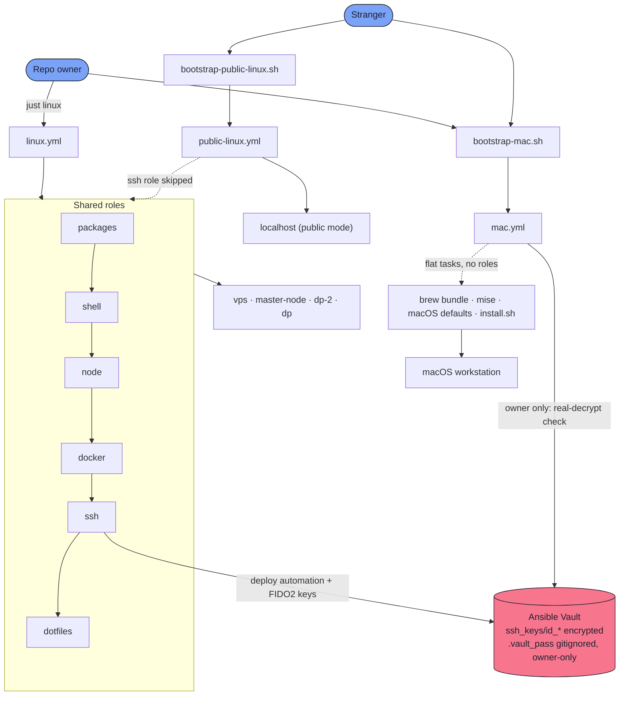

# dots

Personal dotfiles + infrastructure-as-code. One repo, one tool — **Ansible** — provisions both macOS and Linux.

- **Repo owner?** Read **[PERSONAL.md](PERSONAL.md)** — what you get with your vault-decrypted keys.
- **Trying this yourself?** Read **[PUBLIC.md](PUBLIC.md)** — what you get with the public one-liner, no secrets involved.

## Layout

```
bootstrap-mac.sh           # curl one-liner entry point — macOS
bootstrap-public-linux.sh  # curl one-liner entry point — Linux
install.sh                 # symlinks dotfiles; called by the playbooks, not run directly
justfile                   # common tasks: `just lint`, `just check`, `just mac`, `just linux host=vps`
.zshrc, .config/, git/     # dotfiles, symlinked onto the target
ansible/playbooks/         # mac.yml, linux.yml, public-linux.yml
ansible/roles/             # packages, shell, node, docker, ssh, dotfiles
ssh_keys/                  # SSH keys, Ansible Vault-encrypted at rest
```

## Architecture


